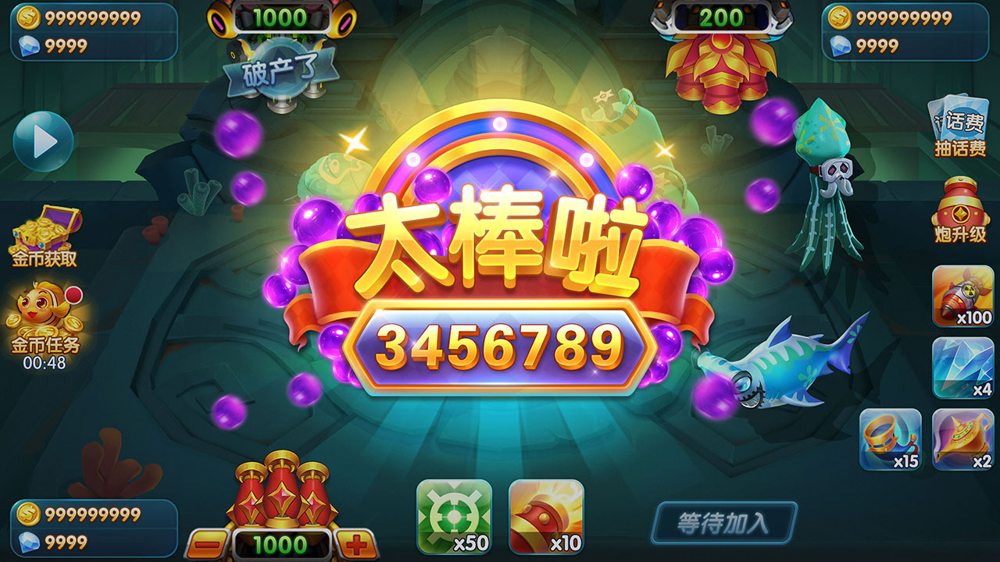
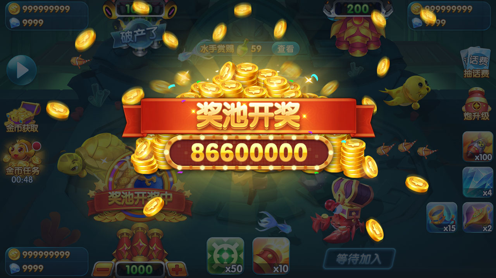
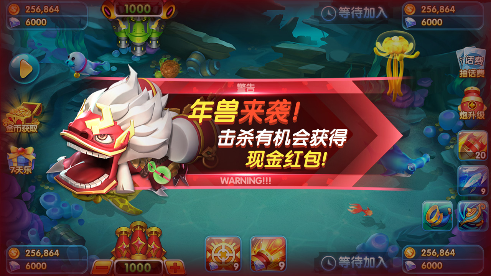
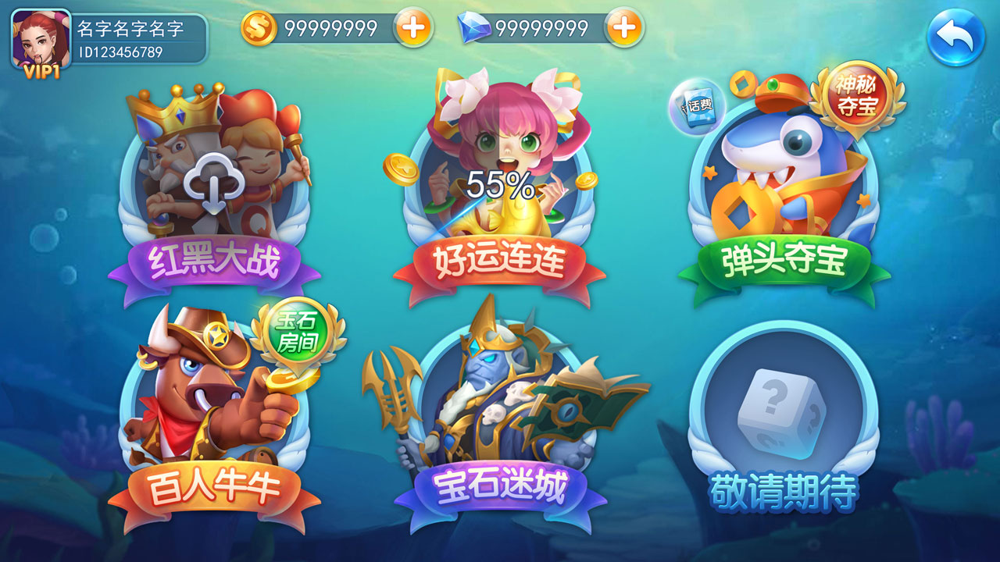
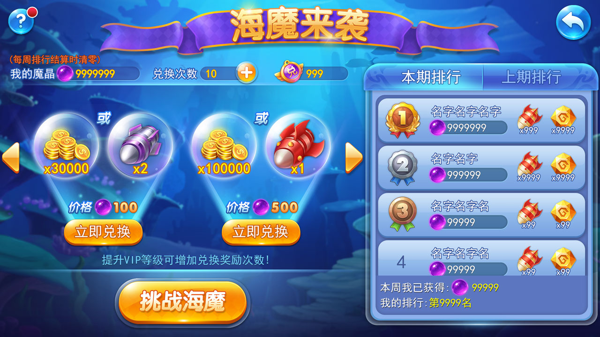

# fishing-game-source｜捕鱼游戏源码 | Fishing Game Source Code | Cocos+C++ 街机捕鱼平台 | 经典模式+比赛+玉石场

[简体中文](README.md) | [繁體中文](README.zh-TW.md) | [English](README.en.md)

<p align="center">
  
  
  
  

 
</p>

<h1 align="center">🎣 Fishing Coin Lobby</h1>

<p align="center">
  <b>捕鱼金币大厅源码 / 捕鱼积分大厅源码 — 商业级街机游戏平台</b><br>
  <b>Commercial Fishing Coin Lobby Source Code | Arcade Game Platform</b><br>
  <b>支持 iOS / Android | 海魔来袭+经典模式+比赛+玉石场+找刺激 | 快速二次开发</b>
</p>
<p align="center">
  <a href="#核心玩法">🎮 核心玩法</a> •
  <a href="#系统功能">🛒 系统功能</a> •
  <a href="#技术架构">⚙️ 技术架构</a> •
  <a href="#部署指南">🚀 快速部署</a>
</p>

---

## 目录

- [项目简介](#项目简介)
- [核心玩法](#核心玩法)
- [系统功能](#系统功能)
- [技术架构](#技术架构)
- [多语言支持](#多语言支持)
- [发布支持](#发布支持)
- [快速定制](#快速定制)
- [项目结构](#项目结构)
- [部署指南](#部署指南)
- [常见问题](#常见问题)
- [许可证](#许可证)
- [联系我们](#联系我们)

---

## 项目简介

**Fishing Coin Lobby（捕鱼金币大厅 / 捕鱼大厅）** 是一套完整的**商业级街机游戏平台源码**，专为追求高性能和稳定运行的运营商打造。

本系统包含 **海魔来袭、经典模式、比赛模式、玉石场、找刺激** 等核心玩法，覆盖 1-30000 倍率区间，内置 **商城、排行榜、保险箱、任务、JackPot、刮刮乐、转盘** 等完整系统，以及 **Node.js 运营后台**，支持**中文、英文等多语言**

| 语言 | 项目名称 |
|------|---------|
| 中文 | 捕鱼金币大厅源码 / 捕鱼源码 / 街机游戏项目 |
| English | Fishing Coin Lobby Source Code / Fish Shooter Platform |


---

## 核心玩法

### 一、海魔来袭
BOSS 级海魔随机登场，全屏攻击，击杀可获得巨额奖励，最高可达 **30000 倍**。

### 二、经典模式
包含 4 大经典场景，倍率覆盖 1-30000 倍：

| 场景 | 倍率范围 | 特点 |
|------|---------|------|
| 海妖漩涡 | 1-5000 倍 | 新手友好，鱼群密集，易上手 |
| 新手滩 | 1-1000 倍 | 入门级场景，适合新玩家练手 |
| 深海巨兽 | 1000-20000 倍 | 大型鱼类出没，奖励丰厚 |
| 幽灵船长 | 5000-30000 倍 | 高难度场景，BOSS 战刺激 |

### 三、比赛模式
定时开启捕鱼比赛，玩家同场竞技，按积分排名发放奖励。

### 四、玉石场
高倍率 VIP 专属场景，倍率 5000-10000 倍：

| 场景 | 倍率范围 | 特点 |
|------|---------|------|
| 亡灵废墟 | 5000-8000 倍 | 暗黑风格，稀有鱼种 |
| 天宫乱斗 | 8000-10000 倍 | 顶级场景，全屏炸弹、连锁闪电 |

### 五、找刺激
内置 12 款休闲小游戏，丰富玩家体验：

- 弹头夺宝
- 四国征战
- 宝石迷城
- 斗地主
- 麻将
- 拼十
- 王者战绩
- 水浒传
- 好运连连
- 龙虎斗
- 红黑大战

---

## 系统功能

### 核心系统模块

- 商城系统 — 金币/钻石获取、道具购买、弹头、VIP 礼包、限时折扣
- 个人中心 — 头像、昵称、战绩、资产、等级、成就系统
- 宝箱系统 — 青铜/白银/黄金/钻石宝箱，定时开启奖励
- 排行榜 — 日榜/周榜/月榜/总榜，财富榜/击杀榜/倍率榜
- 保险箱 — 金币存入保险，防止大额损失，提升留存
- 好友系统 — 添加好友、私聊、查看好友战绩、邀请对战
- 邮件系统 — 系统公告、活动奖励、补偿发放、客服回复
- Facebook 登录 — FB 一键登录、好友邀请、战绩分享
- 设置中心 — 音效、音乐、语言切换、通知管理、账号安全

### 运营活动模块

- 任务系统 — 每日/每周/成长任务，完成任务领金币
- 每日登录 — 连续登录奖励，第 7 天大奖
- 活动中心 — 限时活动聚合页，节日专题活动
- 邀请好友 — 邀请码裂变，双方得金币奖励
- JackPot 奖池 — 全局累积奖池，随机触发大奖
- 刮刮乐彩票 — 虚拟刮刮卡，即时开奖
- 转盘活动 — 幸运大转盘，免费/付费抽奖
- 免费看广告 — 观看激励视频广告得金币

---

## 技术架构

| 层级 | 技术 | 说明 |
|------|------|------|
| 客户端 | Cocos2d-x 3.17+ / Cocos Creator | 跨平台支持 iOS / Android / H5，高性能渲染 |
| 游戏服务端 | C++17 / Boost.Asio | 高性能游戏逻辑服务器，单节点 10000+ 并发 |
| 运营后台 | Node.js + Express + Vue3 | 完整的运营管理系统，数据可视化 |
| 数据库 | MySQL 8.0 + Redis 7.0 | 主从复制 + 集群缓存，支撑高并发读写 |
| 网络协议 | WebSocket + Protobuf | 低延迟实时通信，平均延迟 &lt; 50ms |
| 消息队列 | RabbitMQ | 异步任务、削峰填谷、日志处理 |
| 部署 | Docker + Kubernetes | 容器化部署，一键扩缩容 |
| 监控 | Prometheus + Grafana | 实时性能监控、告警、运营数据看板 |

---

## 多语言支持

- 简体中文 — 完整本地化
- English — 全球化出海标配
- Tiếng Việt — 东南亚热门市场（越南捕鱼市场巨大）
- ภาษาไทย — 泰国街机热门市场
- Bahasa Indonesia — 印尼新兴市场

&gt; 语言包采用 JSON 配置化设计，新增语言仅需翻译文件，无需改代码。


### 定制示例：修改游戏名称

```bash
# 1. 修改客户端配置
vim Client/resources/config/game.json
# 修改 "gameName": "你的游戏名"

# 2. 修改服务端配置
vim Server/config/game.conf
# 修改 game_name = "你的游戏名"

# 3. 修改运营后台配置
vim Admin/.env
# 修改 APP_NAME=你的游戏名

# 4. 重新打包
./build.sh
```

## 项目结构
fishing-coin-lobby/
├── assets/                    # Cocos 客户端
├── Server/                    # C++ 游戏服务端
├── Docs/                      # 部署文档、API 文档、发布指南
└── README.md                  # 本文件


### 部署指南

环境要求

OS: Ubuntu 20.04+ / CentOS 8+
Compiler: GCC 9.4+ / Clang 12+
Build: CMake 3.20+
DB: MySQL 8.0+ / Redis 6.0+
Node.js: 18+ / npm 9+
Client: Cocos2d-x 3.17+ 或 Cocos Creator 3.x


###Docker 一键部署（推荐）
# 1. 克隆仓库
git clone https://github.com/alibabamayun888/fishing-coin-lobby.git
cd fishing-coin-lobby

# 2. 启动全部服务（服务端 + 数据库 + 运营后台）
docker-compose up -d

# 3. 检查服务状态
docker-compose ps

# 4. 查看游戏服务端日志
docker-compose logs -f gameserver

# 5. 访问运营后台
open http://localhost:3000/admin
# 默认账号: admin / admin123

###手动编译部署

# 编译游戏服务端
cd Server
mkdir build && cd build
cmake .. -DCMAKE_BUILD_TYPE=Release
make -j$(nproc)

# 编译运营后台
cd ../Admin
npm install
npm run build

# 启动服务
./Server/build/GameServer --config=../Config/server.conf
cd Admin && npm start

## 产品截图












## 联系我们
| 渠道       | 联系方式                                                                          |
| -------- | ----------------------------------------------------------------------------- |
| Email    | <ttpoker40@gmail.com>                                                         |
| Telegram | [@alibabama401](https://t.me/alibabama401)                                    |
| Issues   | [GitHub Issues](https://github.com/alibabamayun888/fishing-coin-lobby/issues) |


## 常见问题

Q1: 这个项目可以商用吗？需要授权吗？
A: 源码仅供学习研究。如需商用上线运营，请联系获取商业授权协议和技术支持。
Q2: 支持哪些平台？可以发布到 App Store 吗？
A: 支持 iOS 12+ 和 Android 5+
Q3: 二次开发难度大吗？需要多少人团队？
A: 模块化设计，UI/音效/配置均可快速替换。最小团队 1 名 Cocos 开发 + 1 名服务端开发即可在
Q4: 最大支持多少人在线？
A: 单节点部署支持 10000 并发，通过 K8s 横向扩展可支撑百万级 DAU。

<p align="center">
  <b>如果这个项目对你有帮助，请点个 Star 支持一下！</b><br>
  <i>If this project helps you, please give it a star and share it with your friends!</i><br><br>
  <a href="https://github.com/alibabamayun888/fishing-coin-lobby/stargazers">
    
  </a>
</p>
```
