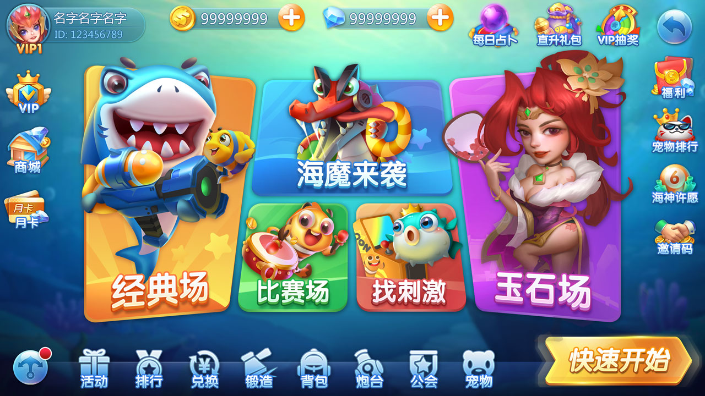
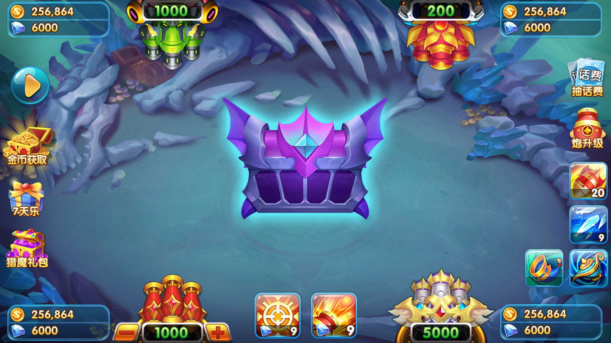
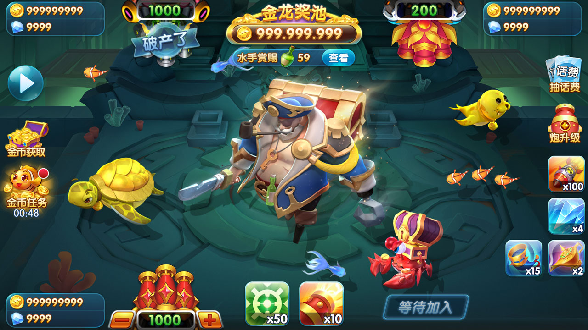
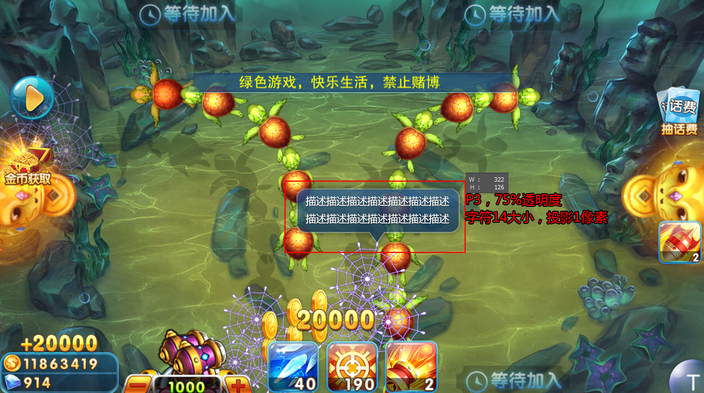

# Fishing Game Source｜Cocos 捕鱼游戏与金币大厅源码

[简体中文](README.md) | [繁體中文](README.zh-TW.md) | [English](README.en.md)

<p align="center">
  
  
  
</p>

**Fishing Game Source** 是一个 Cocos 捕鱼游戏源码项目，包含捕鱼金币大厅、经典模式、比赛模式、玉石场、BOSS 玩法、休闲小游戏及相关系统模块。仓库提供客户端资源与脚本、服务端工具、项目文档和真实产品截图。

## 目录

- [项目简介](#项目简介)
- [核心玩法](#核心玩法)
- [系统功能](#系统功能)
- [技术与目录](#技术与目录)
- [快速开始](#快速开始)
- [产品截图](#产品截图)
- [常见问题](#常见问题)
- [相关文档](#相关文档)
- [许可证与合规](#许可证与合规)
- [联系我们](#联系我们)

## 项目简介

Fishing Coin Lobby（捕鱼金币大厅 / 捕鱼大厅）是一套街机捕鱼游戏平台源码。当前 README 描述的主要内容包括：

- 海魔来袭、经典模式、比赛模式、玉石场和“找刺激”等玩法
- 商城、个人中心、宝箱、排行榜、保险箱、好友、邮件和设置系统
- 任务、每日登录、活动中心、邀请好友、JackPot、刮刮乐和转盘活动
- Cocos Creator 客户端工程、服务端工具与多语言文档
- 面向 iOS 和 Android 的客户端界面

具体功能、倍率和平台支持范围以当前源码、配置和文档为准。

## 核心玩法

### 海魔来袭

BOSS 级海魔随机登场，包含全屏攻击和击杀奖励机制。

### 经典模式

| 场景 | 倍率范围 | 说明 |
|---|---:|---|
| 海妖漩涡 | 1-5000 倍 | 鱼群密集的入门场景 |
| 新手滩 | 1-1000 倍 | 面向新玩家的基础场景 |
| 深海巨兽 | 1000-20000 倍 | 大型鱼类场景 |
| 幽灵船长 | 5000-30000 倍 | 包含 BOSS 战的高倍率场景 |

### 比赛模式

定时开启捕鱼比赛，玩家同场竞技，并根据积分排名发放奖励。

### 玉石场

| 场景 | 倍率范围 | 说明 |
|---|---:|---|
| 亡灵废墟 | 5000-8000 倍 | 暗黑风格与稀有鱼种 |
| 天宫乱斗 | 8000-10000 倍 | 包含全屏炸弹和连锁闪电 |

### 找刺激

原 README 列出的休闲玩法包括弹头夺宝、四国征战、宝石迷城、斗地主、麻将、拼十、王者战绩、水浒传、好运连连、龙虎斗和红黑大战。

## 系统功能

### 核心系统

- **商城系统**：金币、钻石、道具、弹头、VIP 礼包和限时折扣
- **个人中心**：头像、昵称、战绩、资产、等级和成就
- **宝箱系统**：不同等级宝箱及定时奖励
- **排行榜**：日榜、周榜、月榜和多种统计维度
- **保险箱**：游戏资产存取功能
- **好友系统**：好友、私聊、战绩查看和对战邀请
- **邮件系统**：公告、活动奖励、补偿和客服回复
- **Facebook 登录**：账号登录、好友邀请和分享
- **设置中心**：音效、音乐、语言、通知和账号设置

### 运营活动

- 任务系统、每日登录和活动中心
- 邀请好友与双方奖励
- JackPot 奖池、刮刮乐和转盘
- 激励视频广告奖励

## 技术与目录

| 模块 | 真实路径 | 说明 |
|---|---|---|
| Cocos 客户端 | `assets/` | 场景、脚本及资源元数据 |
| 场景 | `assets/scene/` | Cocos 场景文件 |
| 游戏脚本 | `assets/script/` | 客户端逻辑脚本 |
| 服务端工具 | `server/` | 模板、Web 服务目录和运维脚本 |
| 工具 | `tools/` | 配置及辅助工具 |
| 文档 | `doc/`、`docs/` | 项目文档、网页和图片资源 |

```text
fishing-game-source/
├── assets/
│   ├── scene/
│   └── script/
├── server/
│   ├── tpl/
│   └── webserver/
├── tools/
├── doc/
├── docs/
│   └── assets/screenshots/
├── project.json
├── jsconfig.json
└── README.md
```

## 快速开始

```bash
git clone https://github.com/alibabamayun888/fishing-game-source.git
cd fishing-game-source
```

这是一个 Cocos Creator 工程。开发前请根据 `project.json`、`creator.d.ts` 和现有资源选择兼容的 Cocos Creator 版本。客户端内容位于 `assets/`，服务端相关说明位于 [`server/readme`](server/readme)。

> 仓库根目录当前没有 Docker Compose、Kubernetes 或独立 `Admin/` 目录，因此本文不提供相关部署命令或默认后台账号。

## 产品截图

<table>
  <tr><td></td><td></td></tr>
  <tr><td></td><td></td></tr>
  <tr><td></td><td></td></tr>
</table>

更多图片参见 [`docs/assets/screenshots/`](docs/assets/screenshots/)。

## 常见问题

### 可以用于商业运营吗？

源码仅供学习、研究和演示。商业使用需要单独取得授权，并遵守所在地法律、平台政策和项目许可证。

### 支持哪些客户端平台？

原 README 标明支持 iOS 12+ 和 Android 5+。实际构建支持范围取决于 Cocos Creator 版本、项目配置和第三方依赖。

### 如何开始二次开发？

客户端场景和脚本分别位于 `assets/scene/` 与 `assets/script/`。服务端模板和脚本位于 `server/`，辅助工具位于 `tools/`。建议先阅读仓库现有说明和配置。

### 是否提供一键部署？

当前仓库根目录没有 Compose 文件或完整部署编排。请勿直接使用旧 README 中的 Docker、`Admin/` 或大写 `Server/` 命令。

## 相关文档

- [更新日志](CHANGELOG.md)
- [贡献指南](CONTRIBUTING.md)
- [安全策略](SECURITY.md)
- [支持说明](SUPPORT.md)
- [负责任使用规范](RESPONSIBLE-USE.md)
- [服务端说明](server/readme)

## 许可证与合规

本项目采用自定义许可证。学习、研究、分发和商业使用条件以项目现有说明为准；商业使用需要单独取得授权。任何上线、支付、虚拟资产、广告或应用商店发布行为都必须遵守当地法律和平台规则。

## 联系我们

| 渠道 | 联系方式 |
|---|---|
| Email | `ttpoker40@gmail.com` |
| Telegram | [@alibabama401](https://t.me/alibabama401) |
| GitHub Issues | [提交问题](https://github.com/alibabamayun888/fishing-game-source/issues) |

